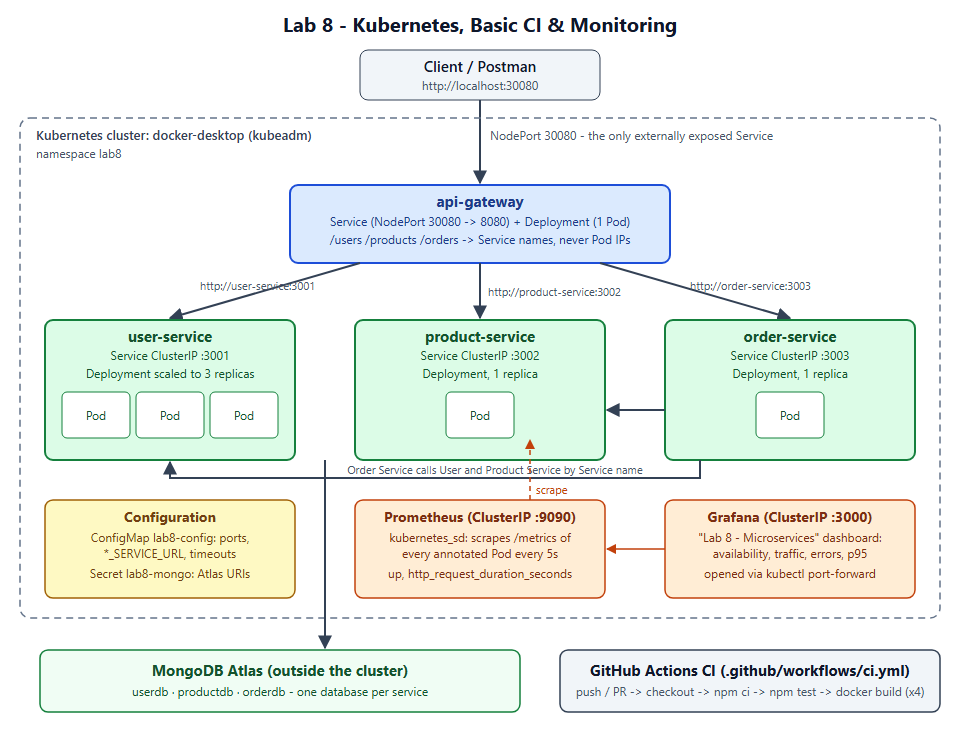
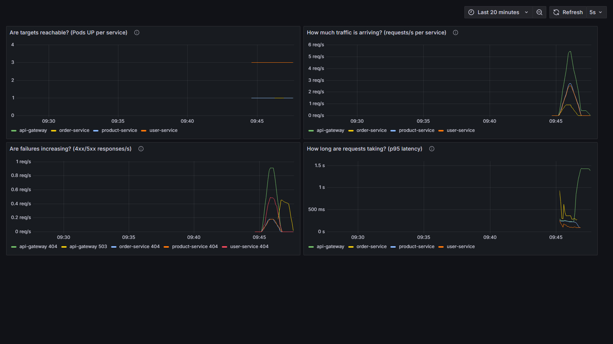

# Lab 8 — Kubernetes, Basic CI/CD & Monitoring

**Sumit Goyal** · Roll No. 202512092
Web Services & SOA Laboratory

---

## 1. Overview and Lab 7 starting point

Lab 7 ended with an API Gateway in front of User, Product and Order Service,
running with Docker Compose, with data in MongoDB Atlas. Lab 8 runs the same
application on Kubernetes, adds a GitHub Actions CI workflow, and monitors the
running system with Prometheus and Grafana.

| Part | What was added |
| ---- | -------------- |
| A. Kubernetes | `k8s/`: Deployment + Service for each of the 4 components, a ConfigMap, a Secret (created from a local file, not committed). Namespace `lab8`. Only the gateway is exposed (NodePort 30080). |
| B. CI | `.github/workflows/ci.yml`: for each service, checkout → `npm ci` → `npm test` → `docker build`. |
| C. Monitoring | Every service exposes `GET /metrics`. `k8s/monitoring/`: Prometheus discovers the Pods on its own. A provisioned Grafana dashboard answers four monitoring questions. |

**Application changes (kept small):**

| Change | Why |
| ------ | --- |
| `express-prom-bundle` middleware in all 4 `server.js` files | Provides `/metrics` with `http_request_duration_seconds` (histogram, labels `method`, `path`, `status_code`) and Node process metrics. `/health` is left out, so probe traffic doesn't hide real traffic. |
| `validateUser` / `validateProduct` moved to `validation.js` (code unchanged) | So they can be unit-tested without a database |
| `test/` in each service, `"test": "node --test"` | CI needs real tests. Uses Node's built-in test runner, so no extra test dependency. 20 tests in total. |
| Image tags `v1` → `v2` | The code changed, so the images get a new version tag |

Routes, status codes, the gateway's 502/503 handling and the service registry
variables are the same as in Lab 7.

The Lab 7 baseline was checked first. The Lab 7 stack ran the Postman collection
with **24 requests, 47 assertions, 0 failed**
([`logs/01-lab7-baseline.txt`](screenshots/logs/01-lab7-baseline.txt)).

---

## 2. Architecture



Source: [`docs/architecture.svg`](docs/architecture.svg)

```
Client / Postman
      │  http://localhost:30080   (NodePort — the only external entry point)
      ▼
┌──────────────────────── Kubernetes: docker-desktop, namespace lab8 ────────────────────────┐
│  api-gateway  (Service NodePort 30080→8080, Deployment 1 Pod)                               │
│      │ http://user-service:3001   │ http://product-service:3002   │ http://order-service:3003 │
│      ▼                            ▼                               ▼                           │
│  user-service (ClusterIP)     product-service (ClusterIP)     order-service (ClusterIP)      │
│  3 Pods after scaling         1 Pod                           1 Pod ──► user / product       │
│                                                                                             │
│  ConfigMap lab8-config · Secret lab8-mongo · Prometheus :9090 · Grafana :3000 (ClusterIP)   │
└───────────────────────────────────────────┬─────────────────────────────────────────────────┘
                                            ▼
                          MongoDB Atlas: userdb · productdb · orderdb
```

### Folder layout

```
lab8/
├── README.md
├── .github/workflows/ci.yml     basic CI (matrix over the 4 services)
├── k8s/
│   ├── configmap.yaml           lab8-config: ports, *_SERVICE_URL, timeouts
│   ├── mongo.env.example        template for the Secret (copy to k8s/mongo.env, gitignored)
│   ├── gateway-deployment.yaml  gateway-service.yaml   (NodePort 30080)
│   ├── user-deployment.yaml     user-service.yaml      (ClusterIP)
│   ├── product-deployment.yaml  product-service.yaml   (ClusterIP)
│   ├── order-deployment.yaml    order-service.yaml     (ClusterIP)
│   └── monitoring/
│       ├── prometheus-rbac.yaml       ServiceAccount + Role (list/watch Pods in lab8)
│       ├── prometheus-config.yaml     scrape config (kubernetes_sd, role: pod)
│       ├── prometheus.yaml            Deployment + ClusterIP Service :9090
│       ├── grafana-provisioning.yaml  data source + "Lab 8 - Microservices" dashboard
│       └── grafana.yaml               Deployment + ClusterIP Service :3000
├── api-gateway/  user-service/  product-service/  order-service/   (each with test/)
├── compose.yaml                 still works locally; also builds the :v2 images
├── postman/
│   ├── API-Gateway-Lab7.postman_collection.json   same collection as Lab 7
│   ├── Lab7-Local.postman_environment.json        baseUrl = http://localhost:8080  (Compose)
│   └── Lab8-K8s.postman_environment.json          baseUrl = http://localhost:30080 (Kubernetes)
├── docs/architecture.svg
└── screenshots/                 PNG evidence + logs/ (raw terminal output of every step)
```

---

## 3. Prerequisites and Kubernetes environment

| Tool | Version used |
| ---- | ------------ |
| Docker Desktop (Windows, WSL2) | Engine 29.8.0 |
| Kubernetes | Docker Desktop built-in cluster, **kubeadm**, 1 node, v1.36.1 |
| kubectl | bundled with Docker Desktop |
| Node.js | 20 (images and CI), 22 on the host |
| MongoDB Atlas | same cluster as Lab 7 (Network Access must allow your IP) |
| Postman / newman | newman 6 via `npx` |

**Why Docker Desktop Kubernetes:** it was already installed. Images built with
`docker build` are visible to the cluster right away, so no registry is needed.
NodePort Services are also published on `localhost`.

Turn it on in Docker Desktop → Settings → Kubernetes → Enable Kubernetes (Kubeadm) → Apply & restart.

### Access the cluster / context

```bash
kubectl config use-context docker-desktop
kubectl config current-context        # docker-desktop
kubectl get nodes                      # docker-desktop   Ready   control-plane   v1.36.1
```

Output: [`logs/02-k8s-environment.txt`](screenshots/logs/02-k8s-environment.txt).

---

## 4. Part A — Deploy on Kubernetes

### 4.1 Build the images

```bash
docker compose build          # builds api-gateway:v2, user-service:v2, product-service:v2, order-service:v2
```

The Deployments use `imagePullPolicy: IfNotPresent`, so the cluster uses these
local images.

### 4.2 Namespace, Secret, manifests

```bash
kubectl create namespace lab8

# Secret: the Atlas connection strings. The file is gitignored; see k8s/mongo.env.example.
cp k8s/mongo.env.example k8s/mongo.env        # then fill in user/password/host
kubectl create secret generic lab8-mongo -n lab8 --from-env-file=k8s/mongo.env

kubectl apply -f k8s/ -n lab8
kubectl get deployments -n lab8
kubectl get pods -n lab8
kubectl get services -n lab8
```

Result ([`logs/03-deploy.txt`](screenshots/logs/03-deploy.txt)):

```
NAME              READY   UP-TO-DATE   AVAILABLE
api-gateway       1/1     1            1
order-service     1/1     1            1
product-service   1/1     1            1
user-service      1/1     1            1

NAME              TYPE        CLUSTER-IP       PORT(S)
api-gateway       NodePort    10.102.104.103   8080:30080/TCP
order-service     ClusterIP   10.96.190.207    3003/TCP
product-service   ClusterIP   10.104.78.153    3002/TCP
user-service      ClusterIP   10.97.190.102    3001/TCP
```

### 4.3 Configuration and service discovery

| Name | Kind | Holds | Used by |
| ---- | ---- | ----- | ------- |
| `lab8-config` | ConfigMap | `GATEWAY_PORT`, `USER/PRODUCT/ORDER_SERVICE_PORT`, `USER/PRODUCT/ORDER_SERVICE_URL`, `PROXY_TIMEOUT_MS`, `DEPENDENCY_TIMEOUT_MS`, `DEPENDENCY_RETRIES` | all four Deployments (`configMapKeyRef`) |
| `lab8-mongo` | Secret | `USER_MONGO_URI`, `PRODUCT_MONGO_URI`, `ORDER_MONGO_URI` | each service's `MONGO_URI` (`secretKeyRef`) |
| `grafana-admin` | Secret | `admin-password` | Grafana |

- The registry values are **Kubernetes Service names** such as
  `http://user-service:3001`. Cluster DNS resolves each name to the Service's
  stable ClusterIP, and the Service load-balances across the Pods that are
  currently Ready. No Pod IP is written down anywhere.
- These are the same variable names Lab 7 used, so the code didn't change.
  Only the values moved from `.env` into the ConfigMap.
- `enableServiceLinks: false` turns off the old Docker-link-style variables
  (such as `USER_SERVICE_PORT=tcp://…`) that Kubernetes would otherwise inject,
  so the only configuration comes from the ConfigMap.
- `kubectl describe pod` shows only the Secret's name and key, never its value:
  `MONGO_URI: <set to the key 'ORDER_MONGO_URI' in secret 'lab8-mongo'>`.

**Probes.** `readinessProbe` is `GET /health`. The services answer `503` until
their Atlas connection is up, so a Pod only receives traffic once it can serve
it. `livenessProbe` is a TCP check, so a short Atlas outage doesn't make
Kubernetes restart the containers. The gateway uses `/health` for both probes,
because its `/health` doesn't depend on the backends.

### 4.4 Expose and test the gateway

The gateway Service is `type: NodePort` with `nodePort: 30080`. Docker Desktop
publishes NodePorts on the host, so the gateway is at **http://localhost:30080**.
The three services are `ClusterIP` and can't be reached from outside the cluster.

```bash
curl http://localhost:30080/health
curl http://localhost:30080/health/services     # gateway -> each Service's /health: all reachable, db connected
npx newman run postman/API-Gateway-Lab7.postman_collection.json -e postman/Lab8-K8s.postman_environment.json
```

In Postman: import the collection and `Lab8-K8s.postman_environment.json`,
select **Lab8 - Kubernetes**, and run folders 1–5. Result
([`logs/04-gateway-test.txt`](screenshots/logs/04-gateway-test.txt)): **24 requests, 47 assertions, 0 failed**.
That is the same result as the Lab 7 baseline.

The logs show that internal routing uses Service names:

```
[api-gateway] POST /users -> user-service (http://user-service:3001) 201 59ms
[api-gateway] GET /orders/6abb…?expand=true -> order-service (http://order-service:3003) 200 244ms
[order-service] -> GET http://user-service:3001/users/6abb… : 200
[order-service] -> PATCH http://product-service:3002/products/6abb…/stock : 200
```

### 4.5 Scaling

```bash
kubectl scale deployment user-service --replicas=3 -n lab8
kubectl get pods -n lab8 -l app=user-service
```

([`logs/05-scaling.txt`](screenshots/logs/05-scaling.txt))

```
user-service   3/3     3            3

user-service-64f5c9bcf8-fkn62   1/1   Running   10.1.0.10
user-service-64f5c9bcf8-mb2cj   1/1   Running   10.1.0.11
user-service-64f5c9bcf8-n6b9f   1/1   Running   10.1.0.9

NAME                 ENDPOINTS
user-service-4g5lx   10.1.0.9,10.1.0.10,10.1.0.11      <- one Service, three Pods behind it
user-service         ClusterIP   10.97.190.102          <- ClusterIP unchanged
```

After 9 `GET /users` calls through the gateway, the three Pods had served 3, 3
and 4 requests. The Service load-balanced them, and the gateway's
configuration (`http://user-service:3001`) stayed the same.

### 4.6 Self-healing

```bash
kubectl get pods -n lab8
kubectl delete pod user-service-64f5c9bcf8-fkn62 -n lab8
kubectl get pods -n lab8 -l app=user-service
```

([`logs/06-self-healing.txt`](screenshots/logs/06-self-healing.txt))

```
# immediately after delete
user-service-64f5c9bcf8-fkn62   0/1   Error     18s     <- deleted Pod shutting down
user-service-64f5c9bcf8-mb2cj   1/1   Running   18s
user-service-64f5c9bcf8-n6b9f   1/1   Running   77s
user-service-64f5c9bcf8-n6ctl   0/1   Running   1s      <- replacement created by the ReplicaSet

# ~12 s later
user-service-64f5c9bcf8-mb2cj   1/1   Running   31s
user-service-64f5c9bcf8-n6b9f   1/1   Running   90s
user-service-64f5c9bcf8-n6ctl   1/1   Running   14s     <- Ready: desired state 3/3 restored
```

The ReplicaSet event shows `Created pod: user-service-64f5c9bcf8-n6ctl`, and
`GET /users` kept returning `200` during the replacement. The deleted Pod shows
`Error` only because `npm start` exits with code 143 when it gets SIGTERM. That
is expected and harmless.

---

## 5. Part B — GitHub Actions CI

Repository: **https://github.com/sumit-0804/lab-8-kubernetes-cicd**

[`.github/workflows/ci.yml`](.github/workflows/ci.yml):

| Item | Value |
| ---- | ----- |
| Triggers | `push`, `pull_request` |
| Runner | `ubuntu-latest` |
| Matrix | `api-gateway`, `user-service`, `product-service`, `order-service` (`fail-fast: false`, so every service reports) |
| Steps | `actions/checkout@v7` → `actions/setup-node@v7` (Node 20, npm cache per service) → `npm ci` → `npm test` → `docker build -t <service>:${{ github.sha }} .` |

What the tests cover (no database or network needed, so CI is deterministic):

| Service | Test file | Checks |
| ------- | --------- | ------ |
| api-gateway | `test/config.test.js` | routing table built from `*_SERVICE_URL`; rejects missing, non-http, path-carrying and invalid URLs and a bad `PORT` |
| user-service | `test/validation.test.js` | valid user, all fields missing, bad email, semester range, partial validation |
| product-service | `test/validation.test.js` | valid product, missing fields, sku format, negative price / fractional stock, partial validation |
| order-service | `test/serviceClient.test.js` | against a local stub server: a 200 is parsed, a 404 is passed through, a closed port throws `DependencyUnavailableError` (the 503 path) |

Run locally: `cd <service> && npm ci && npm test`.

### CI runs

| Run | Trigger | Result |
| --- | ------- | ------ |
| [#1](https://github.com/sumit-0804/lab-8-kubernetes-cicd/actions/runs/36521278641) | first push | 4/4 jobs passed (~20 s each) |
| [#2](https://github.com/sumit-0804/lab-8-kubernetes-cicd/actions/runs/36521378035) | small change: `actions/checkout` and `actions/setup-node` upgraded `v4` → `v7`, because run #1 warned that the v4 actions use the deprecated Node 20 runtime | 4/4 jobs passed, warning gone |
| [#3](https://github.com/sumit-0804/lab-8-kubernetes-cicd/actions/runs/36521532466) | same commits pushed again after a history cleanup | 4/4 jobs passed. Log: api-gateway `# tests 7 # pass 7 # fail 0`, `naming to docker.io/library/api-gateway:77d258f…` ([`logs/12-github-actions.txt`](screenshots/logs/12-github-actions.txt)) |

---

## 6. Part C — Prometheus and Grafana

### 6.1 Deploy

```bash
kubectl create secret generic grafana-admin -n lab8 --from-literal=admin-password=<choose-one>
kubectl apply -f k8s/monitoring/ -n lab8

kubectl port-forward -n lab8 svc/prometheus 9090:9090     # http://localhost:9090
kubectl port-forward -n lab8 svc/grafana    3000:3000     # http://localhost:3000
```

Prometheus and Grafana are `ClusterIP` and opened with `port-forward`, so the
gateway is still the only thing exposed. Grafana allows anonymous **Viewer**
access for the dashboard. To log in as admin, use user `admin` and the password
from the `grafana-admin` Secret:
`kubectl get secret grafana-admin -n lab8 -o jsonpath="{.data.admin-password}" | base64 -d`.

### 6.2 Targets and metrics

Prometheus uses `kubernetes_sd_configs` (`role: pod`, namespace `lab8`). Any Pod
with `prometheus.io/scrape: "true"` becomes a target, and the port and path
come from its annotations. The Pod's `app` label and Pod name are copied onto
every series. So when a Deployment is scaled or a Pod is replaced, Prometheus
finds the new Pods with no config change. The RBAC it needs is only a
namespaced Role (`get/list/watch` on pods, services, endpoints).

Targets ([`10-prometheus-targets.png`](screenshots/10-prometheus-targets.png),
[`logs/08-prometheus-targets-and-queries.txt`](screenshots/logs/08-prometheus-targets-and-queries.txt)):
**lab8-pods 6/6 UP** (3 × user-service, api-gateway, order-service, product-service), plus Prometheus itself.

| Metric | Type | Labels |
| ------ | ---- | ------ |
| `up` | gauge (from Prometheus) | `job`, `app`, `pod`, `instance` |
| `http_request_duration_seconds_bucket/_sum/_count` | histogram | `method`, `path` (ids normalised to `#val`), `status_code`, `app`, `pod` |
| `process_*`, `nodejs_*` | default Node metrics | `app`, `pod` |

`http_request_duration_seconds_count` is the request counter. It plays the role
of the `http_requests_total` metric in the lab sheet.

Useful queries:

```promql
up{job="lab8-pods"}                                                                    # is every Pod reachable?
sum by (app) (rate(http_request_duration_seconds_count{job="lab8-pods"}[1m]))          # traffic, req/s
sum by (app, status_code) (rate(http_request_duration_seconds_count{status_code=~"4..|5.."}[1m]))   # errors
histogram_quantile(0.95, sum by (le, app) (rate(http_request_duration_seconds_bucket[1m])))         # p95 latency
```

### 6.3 Grafana dashboard

The data source and dashboard are provisioned from `grafana-provisioning.yaml`,
so a new Grafana Pod loads the same dashboard. **Lab 8 → Lab 8 - Microservices**
refreshes every 5 s, and each panel answers one question:

| Panel | Question | Query |
| ----- | -------- | ----- |
| Pods UP per service | Are targets reachable? | `sum by (app) (up{job="lab8-pods"})` |
| Requests/s per service | How much traffic is arriving? | `sum by (app) (rate(http_request_duration_seconds_count[1m]))` |
| 4xx/5xx responses/s | Are failures increasing? | `sum by (app, status_code) (rate(…{status_code=~"4..\|5.."}[1m]))` |
| p95 latency | How long are requests taking? | `histogram_quantile(0.95, sum by (le, app) (rate(…_bucket[1m])))` |



### 6.4 Traffic and observation

1. **Before:** a snapshot of the queries.
2. **Normal traffic:** the Postman collection 10 times through `localhost:30080`
   (240 requests, 0 failed, including the deliberate invalid-id `404` requests),
   plus 80 plain `GET`s ([`logs/10-newman-traffic-k8s.txt`](screenshots/logs/10-newman-traffic-k8s.txt)).
3. **Controlled failure:** `kubectl scale deployment product-service --replicas=0`,
   31 × `GET /products` → the gateway answered `503 … "reason":"ECONNREFUSED"`,
   then scaled back to 1 → `200` ([`logs/11-controlled-failure.txt`](screenshots/logs/11-controlled-failure.txt)).

From [`logs/09-traffic-before-after.txt`](screenshots/logs/09-traffic-before-after.txt):

| Query | Before | After normal traffic | During failure |
| ----- | ------ | -------------------- | -------------- |
| Pods up (user / product / order / gateway) | 3 / 1 / 1 / 1 | 3 / 1 / 1 / 1 | 3 / **0** / 1 / 1 |
| Total requests at gateway | 32 | **332** | 363 |
| Gateway req/s (1m rate) | 0 | **5.07** | 1.41 |
| Gateway 404s | 5 | **55** | 55 |
| Gateway 503s | — | — | **31** |
| Gateway p95 latency | no data | 0.229 s | **1.301 s** |

On the dashboard, traffic rose for all four services (the gateway fans out to
them). The errors panel showed the 404 bumps and then a separate
`api-gateway 503` line. Gateway p95 latency jumped while product-service was
down. The Prometheus table view of
`sum by (app, status_code) (http_request_duration_seconds_count)` shows
`api-gateway 503 = 31` ([`11-prometheus-query.png`](screenshots/11-prometheus-query.png)).

---

## 7. Part D — End-to-end verification

| Check | Where |
| ----- | ----- |
| Application runs on Kubernetes | `logs/03-deploy.txt` |
| Gateway is the client-facing entry point (only NodePort; others ClusterIP) | `logs/03-deploy.txt`, `logs/04-gateway-test.txt` |
| Internal calls use Service names | gateway + order-service logs in `logs/04-gateway-test.txt` |
| Scaling and self-healing | `logs/05-scaling.txt`, `logs/06-self-healing.txt` |
| Successful GitHub Actions run | section 5 / Actions tab |
| Prometheus targets and queries | `10-prometheus-targets.png`, `11-prometheus-query.png`, `logs/08`, `logs/09` |
| Grafana responding to traffic | `12-grafana-dashboard.png` |

---

## 8. Evidence

| No. | Evidence | File |
| --- | -------- | ---- |
| 1 | Lab 7 baseline | [`logs/01-lab7-baseline.txt`](screenshots/logs/01-lab7-baseline.txt) · [`01-postman-lab7-baseline.png`](screenshots/01-postman-lab7-baseline.png) |
| 2 | Kubernetes environment (context + node) | [`logs/02-k8s-environment.txt`](screenshots/logs/02-k8s-environment.txt) |
| 3 | Manifests | [`k8s/`](k8s/), [`k8s/monitoring/`](k8s/monitoring/) |
| 4 | Deployment (Pods, Deployments, Services) | [`logs/03-deploy.txt`](screenshots/logs/03-deploy.txt) |
| 5 | Gateway test through Kubernetes | [`logs/04-gateway-test.txt`](screenshots/logs/04-gateway-test.txt) · [`04-postman-k8s-gateway.png`](screenshots/04-postman-k8s-gateway.png) |
| 6 | Scaling to 3 | [`logs/05-scaling.txt`](screenshots/logs/05-scaling.txt) |
| 7 | Self-healing | [`logs/06-self-healing.txt`](screenshots/logs/06-self-healing.txt) |
| 8 | Troubleshooting (describe / logs / endpoints) | [`logs/07-troubleshooting.txt`](screenshots/logs/07-troubleshooting.txt) |
| 9 | GitHub Actions | [`logs/12-github-actions.txt`](screenshots/logs/12-github-actions.txt), [Actions tab](https://github.com/sumit-0804/lab-8-kubernetes-cicd/actions) · [`09-github-actions.png`](screenshots/09-github-actions.png) |
| 10 | Prometheus | [`10-prometheus-targets.png`](screenshots/10-prometheus-targets.png), [`11-prometheus-query.png`](screenshots/11-prometheus-query.png), [`logs/08`](screenshots/logs/08-prometheus-targets-and-queries.txt) |
| 11 | Grafana | [`12-grafana-dashboard.png`](screenshots/12-grafana-dashboard.png) |
| 12 | Traffic before/after | [`logs/09-traffic-before-after.txt`](screenshots/logs/09-traffic-before-after.txt), [`logs/10`](screenshots/logs/10-newman-traffic-k8s.txt), [`logs/11`](screenshots/logs/11-controlled-failure.txt) |
| 13 | Architecture | [`13-architecture.png`](screenshots/13-architecture.png) |

---

## 9. Troubleshooting

Commands used:

```bash
kubectl describe pod <pod-name> -n lab8     # events, probe failures, env (Secret shown by name only)
kubectl logs <pod-name> -n lab8             # app output, e.g. "user-db connected", routing lines
kubectl get endpointslices -n lab8          # which Pod IPs are behind each Service
```

A real example from this run ([`logs/07-troubleshooting.txt`](screenshots/logs/07-troubleshooting.txt)):
right after startup, `describe` showed
`Readiness probe failed: … connect: connection refused` twice for order-service.
The Pod was still connecting to Atlas, and Kubernetes held back traffic until
`/health` returned 200.

| Problem | Cause / fix |
| ------- | ----------- |
| Pod `CreateContainerConfigError` | The `lab8-mongo` (or `grafana-admin`) Secret is missing. Create it (4.2 / 6.1). The Pod starts once the Secret exists. |
| Pod `ErrImageNeverPull` / `ImagePullBackOff` | The `:v2` images weren't built locally, or the cluster isn't Docker Desktop. Run `docker compose build`. With minikube/kind, load the images into the cluster first. |
| Pod Running but `0/1` Ready, logs `not reachable (attempt n/10)` | Atlas refused the connection. Check Network Access (your IP) and the URI in `k8s/mongo.env`, then recreate the Secret and `kubectl rollout restart deployment -n lab8`. |
| Gateway `503`, `reason: ECONNREFUSED` | The Service has no Ready endpoints (scaled to 0, or Pods not Ready). `kubectl get endpointslices -n lab8`. |
| Gateway `503`, `reason: ENOTFOUND` | Wrong Service name in `lab8-config`. Fix it and `kubectl rollout restart deployment/api-gateway -n lab8` (env vars are read at startup). |
| Service reachable but no endpoints | The Service `selector` doesn't match the Pod labels (`app: <name>`) or the `targetPort` name (`http`). |
| `localhost:30080` not answering | Kubernetes isn't running in Docker Desktop, or the gateway Pod isn't Ready (`kubectl get pods -n lab8`). |
| Prometheus target missing | The Pod has no `prometheus.io/scrape: "true"` annotation, or the Role/RoleBinding wasn't applied (`kubectl logs deploy/prometheus -n lab8` shows `forbidden`). |
| Grafana panels empty | Traffic is needed for the `rate()` panels. The data source should show "Successfully queried the Prometheus API" under Connections → Data sources. |
| Deleted Pod briefly shows `Error` | `npm start` exits with code 143 on SIGTERM. The replacement Pod is what matters. |
| `Warning: v1 Endpoints is deprecated` | Harmless on Kubernetes 1.33+. Use `kubectl get endpointslices` instead. |

### Clean up

```bash
kubectl delete namespace lab8
```

---

## 10. Good practices followed

- No credentials in Git: Atlas URIs and the Grafana password live only in
  Kubernetes Secrets, created from gitignored files or command-line values.
  `.env` and `k8s/mongo.env` are in `.gitignore`.
- Configuration lives outside the images (ConfigMap/Secret). The same `:v2`
  images run under Compose and Kubernetes.
- Every object carries `app: <name>` and `part-of: lab8` labels. Selectors
  match only on `app`.
- Versioned image tags (`v2`, plus `:${{ github.sha }}` in CI), never `latest`.
- Only the gateway is exposed. Services, Prometheus and Grafana are ClusterIP.
- Resource requests and limits, plus readiness and liveness probes, on every container.
- The workflow is small: one job, a matrix, five steps, and no secrets.

---

## 11. Checklist

- [x] Lab 7 application verified
- [x] Kubernetes context/node verified
- [x] `lab8` namespace created and used
- [x] Gateway/User/Product/Order Deployments and Services created
- [x] ConfigMap/Secret used appropriately
- [x] Application deployed and verified
- [x] Gateway tested from Postman
- [x] User Service scaled to 3 replicas
- [x] Self-healing demonstrated
- [x] Basic GitHub Actions CI passed
- [x] Prometheus targets/metrics verified
- [x] Grafana dashboard created
- [x] API traffic generated and observed
- [x] README updated
- [x] All required screenshots/evidence collected
